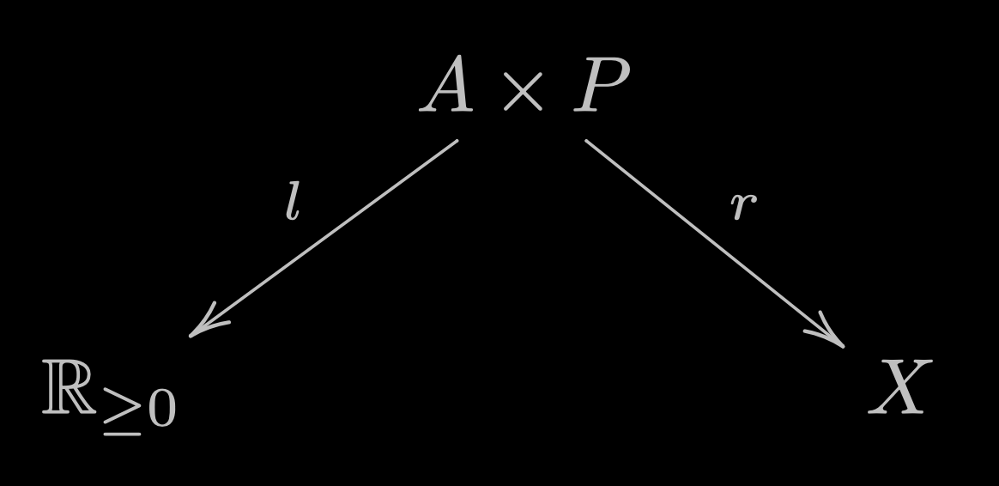

<script src="https://cdn.tailwindcss.com/3.0.0"></script>
<script>tailwind.config = { corePlugins: { preflight: false } }</script>

# Statistical programming with categorical measure theory & [LazyPPL](https://lazyppl.github.io/)

*Swaraj Dash, <u>Younesse Kaddar</u>, Hugo Paquet, Sam Staton*

 <span class="relative left-16"></span>


---
# Probabilistic Programming

### Bayes' law
$$\underbrace{p(x \mid d)}_{\mathrm{posterior}} \propto \underbrace{p(d \mid x)}_{\mathrm{likelihood}} × \underbrace{p(x)}_{\mathrm{prior}}$$

* `sample`: prior
* `observe`/`score`: likelihood, conditioning on the observations $d$
* `infer`/`normalize`: posterior, inference from effects (observations $d$) to causes (parameters $x$)

---
# Demo

```haskell
linear :: Prob (Double -> Double)
linear = do
  a <- normal 0 3
  b <- normal 0 3
  let f = \x -> a * x + b
  return f

regress :: Double -> Prob (a -> Double) -> [(a, Double)] -> Meas (a -> Double)
regress σ prior dataset = do
    f <- sample prior
    mapM_ (\(x, y) -> score $ normalPdf (f x) σ y) dataset
    return f
```

---
# Semantically



Inference: 
* pick a parameter $p$ by sampling a point from the area under the curve of the weight function $l$ 
* use this parameter $p$ to determine a result $r(p)$.

---

# Problems

* $\cal Meas$ **not cartesian closed**: 
  * no function space like `Double -> Double`


* Not known if there is a commutative monad of measures 
  * the category of s-finite kernels is distributive symmetric monoidal
  * but is it a Kleisli category?


---

## Inverse Transform Sampling

> **Noise outsourcing lemma**: The law of every Borel-valued random variable can be obtained as a pushforward of the uniform measure on $[0,1]$.

Given a parameterized probability distribution $k：A → {\cal P} (B)$, there is a function $f： A × [0, 1] → B$ such that for all $a$, 
$$k(a) \overset{\cal D}{=} f(a, u) \quad \text{where } u \sim {\cal U}([0, 1])$$


```haskell
k(a) = do { u ← uniform 0 1; return f (a, u) }
```

---

# Quasi-Borel Spaces
* $Ω$: fixed uncountable standard Borel space
  - LazyPPL: infinite rose trees, with splitting $γ：Ω ≅ Ω × Ω$

* **quasi-Borel space $X$**: with set $M_X ⊆ X^{Ω}$ of *random elements*

* $Qbs$: cartesian closed, commutative monad of measures
  * LazyPPL: `Prob` vs `Meas` ⟶ two Kleisli categories
  * Laziness in program evaluation: monoidal category $\cal Kl(\texttt{Prob})$ has a terminal unit

---

# Proba and Measure Kernels

- `Prob`: Probability kernels $f：X × Ω → Y$ modulo equivalence
  - *Composition*: $X × Ω \xrightarrow {X × γ} X × Ω × Ω \xrightarrow {f × Ω} Y × Ω \xrightarrow {g} Z$
  - Monad on $Qbs$: $X ↦ X^Ω$

- `Meas`: Measure kernels $[0, \infty] \xleftarrow{l} X × Ω \xrightarrow{f} Y$ mod equiv 
  - *Composition*: compose the proba kernels, multiply the weights
  - Monad on $Qbs$: $X ↦ (X × ℝ)^Ω$


---

# Correspondence

| Proba | Categorical Proba | Prob Prog |
| ----------- | ----------- | ----------- |
| Spaces | Objects | Types |
| Proba kernels | Morphisms | Programs |
| Fubini's theorem | Interchange law / Commutativity | Reordering lines |
| Marginalisation | Semi-cartesianness / Affineness | Discarding / Laziness |

<style scoped>
table {
    margin-left: auto;
    margin-right: auto;
}
</style>


---

# Demo

- Poisson point process
- Piecewise regression
- Program induction
- Wiener process
- More on https://lazyppl.bitbucket.io!


